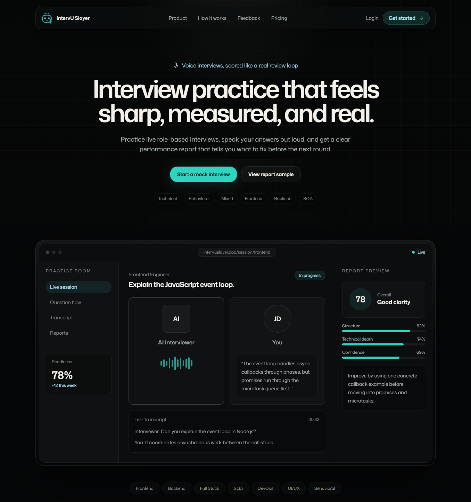

# IntervU Slayer

IntervU Slayer is an AI-powered interview preparation platform designed to help developers prepare strategically instead of relying on random mock interviews.

Unlike traditional interview generators, IntervU Slayer combines structured interview roadmaps, targeted practice sessions, skill analytics, and readiness tracking to create a complete interview preparation experience.

#### 🌐 Live Demo: https://intervuslayer.vercel.app/



---

## Features

### 1. Interview Roadmaps

Generate personalized interview preparation roadmaps based on:
- Target role
- Experience level
- Technology stack
- Job descriptions

Each roadmap is divided into modules that guide users through a structured learning and practice journey.

### 2. AI Interview Generation
Generate realistic interview sessions tailored to:
- Technical interviews
- Behavioral interviews
- Mixed interviews

Practice with questions relevant to your goals and experience level.

### 3. Job Description Analysis
Paste a real job description and IntervU Slayer automatically extracts:
- Role title
- Seniority level
- Relevant technologies
- Focus areas
- Suggested interview setup

Users can review and edit the extracted information before generating interviews or roadmaps.

### 4. Skill Graph

Track performance across multiple interview dimensions, including:
- Communication
- Technical depth
- Problem solving
- Framework knowledge
- Behavioral skills
- System design

Identify strengths and uncover areas that need improvement.

### 5. Progressive Roadmap Navigation
Roadmaps unlock progressively as users complete interview rounds.

This encourages deliberate practice and helps candidates build confidence one skill area at a time.

### 6. Detailed Feedback Reports

After each interview session, users receive reports containing:
- Overall performance scores
- Category breakdowns
- Strengths
- Areas for improvement
- Actionable recommendations

---

## Tech Stack
### Frontend
- Next.js (App Router)
- React 19
- TypeScript
- Tailwind CSS
- Framer motion
- React Hook Form
- Zod

### Backend & Database
- Next.js Server Actions
- Firebase Authentication
- Firebase Firestore

### AI & Voice
- Groq API
- Vapi AI

---

## Why IntervU Slayer?

Most AI interview tools focus only on generating questions. IntervU Slayer focuses on building interview readiness through structured improvement.

The goal isn't simply to complete mock interviews—it's to help users understand:
- What to practice
- Why they should practice it
- Whether they're actually improving

---

## Getting Started
#### Clone the repository
```
git clone https://github.com/tasmia-rafiq/intervuslayer
cd intervuslayer
```
#### Install dependencies
```
npm install
```

#### Configure environment variables

Create a .env.local file and add the required credentials:
```
FIREBASE_PROJECT_ID=
FIREBASE_PRIVATE_KEY=
FIREBASE_CLIENT_EMAIL=
NEXT_PUBLIC_VAPI_WEB_TOKEN=
NEXT_PUBLIC_VAPI_WORKFLOW_ID=
GROQ_API_KEY=
```

#### Start the development server
```
npm run dev
```
Open:
```
http://localhost:3000
```
---

## Future Improvements
- AI Interview Coach
- Resume Analysis
- Company-specific interview preparation
- Personalized study recommendations
- Advanced progress analytics

---

## Author
**Tasmia Rafiq**
Software Engineer — Full Stack Developer